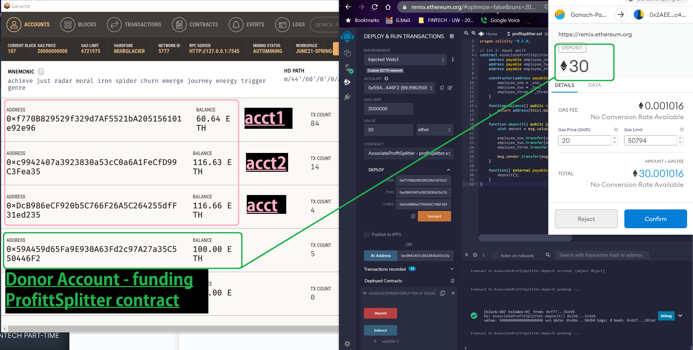
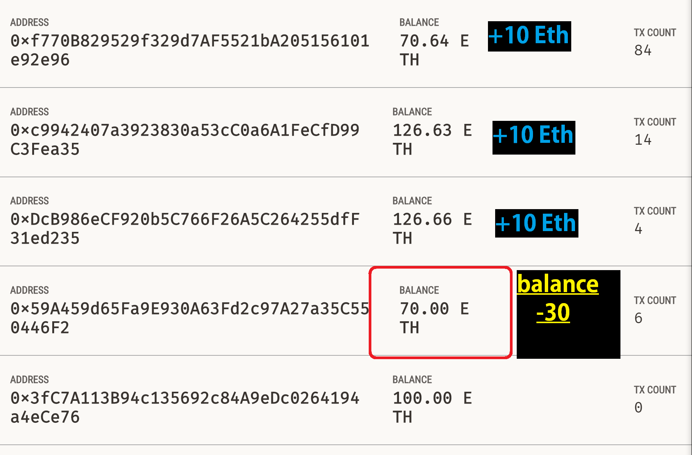
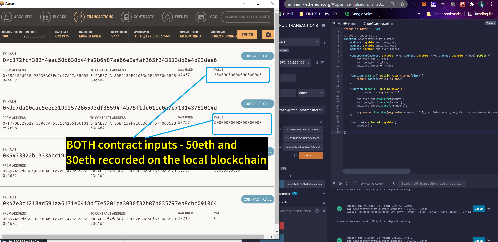

# 20_Solidity_Profit_and_Equity

# Deploying Local Blockchain 

Getting <u>Ganace</u> ready - with 3 recipient accounts and 1 donor account 

### Now Deploying Contract ***PROFITSPLITTER.SOL***
* 
* smaller amounts in test, either ***wei*** or ***gwei*** were opaque, or difficult to spot 
* testing with largest amounts (30 or 50 eth) is more conspicuous 

#### SUCCESS !

### Confirming Transaction on Local Blockchain 
* YES ! Success 
* 

### Reviewing both transactions 
* Success - both 30eth and 50eth transactions successfully created 
* Succesfully distributed
* 

---

#### ***Until Next Time . . . ***
